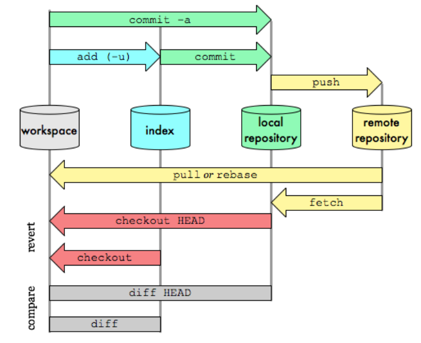

### Intro

`git` - the stupid content tracker...or a fast, scalable, distributed revision control system with an unusually rich command set that provides both high-level operations and full access to internals.

**Git tracks content not files**: Git’s object store is based on the hashed computation of the contents of its objects, not on the file or directory names from the user’s original file layout. 

If two separate files located in two different directories have exactly the same content, Git stores a sole copy of that content as a `blob` (binary large objects) within the object store.

Nice video [Linus Torvalds & git](https://www.youtube.com/watch?v=idLyobOhtO4)

### Git Transport



### Terms

**Working tree**: a directory structure that contains all of the project's files.	

**Repository (repo)**: the directory located at the top level of a working tree, hosting all of the project's files along with the version history of these files.

**Clone***: the action of creating a copy of a remote repository on a local machine to work on a project to which you have access.

**Commit**: a snapshot of the changes made to the files in a repository at a specific point in time. Commits are used to record and save changes.	

**Staging area**: an intermediate location (which isn't part of the repository) where changes to files in the working tree are prepared before they're committed. It allows developers to select changes they intend to commit.

**Branch**: a named series of linked commits,represents a distinct version of a project, the most recent commit within a branch is called the head

**Merge**: the process of combining changes from one branch (or commit) into another. This integrates changes from one branch into another 	

**Object**: one of four types of entities available in a repo. These entities include blobs representing individual files, a tree representing a working tree, a commit representing a specific version of the working tree, and a *tag, which is a label assigned to an individual commit.


### Generic flow

* Add file to staging/index:

```bash
# add to stage aka create a blob
git add ...

# check blobs
git rev-list --objects --all
git log --oneline
```
* Create a snapshot

```bash
# commit aka create tree object
git commit -m 'mesage here`

# send changes to remote repo
git push
```

### Scenarios

* UNDO

```bash
# local undo commits and PRESERVE changes
git reset --soft HEAD^  # last commit
git reset --soft HEAD~2 # last 2 commits

# local undo commits and REMOVE changes
git reset --hard HEAD~1

# public undo commit aka rewrite history aka add new commits to reverse the effect of some earlier commits
git revert <commit_sha>

# revert last 2 commits
git revert HEAD~2..HEAD
```

* Rewriting history ...  to cleanup commit history

```bash
# SQUASHING: manually interactive rebase aka combine multiple commits into one
git rebase -i HEAD~3 # last 3 commits

# AMEND aka update the most recent commit message
git commit --amend # interactive
```

* Bring changes to your branch

```bash
# bring feat/git to main
git checkout main
git merge feat/git # keep original commits from feat/git intact
git rebase feat/git # rewrite commit history
```
